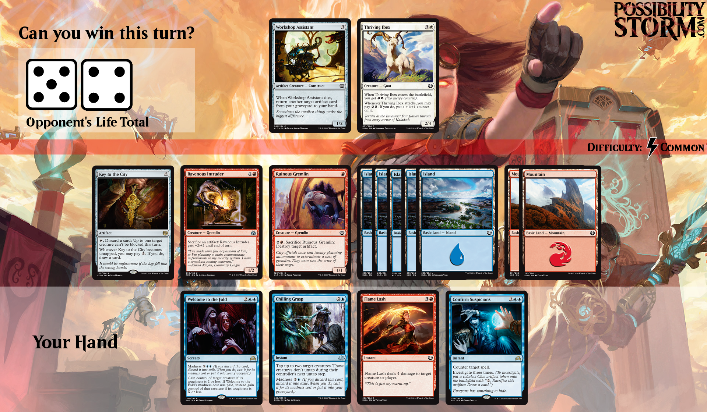

# mtg-benchmark

LLM benchmark harness for MTG puzzles, sourced from [Possibility Storm](https://www.patreon.com/mtgpuzzles). Web leaderboard: [mtg-benchmark-site](https://github.com/wanqizhu/mtg-benchmark-site) ([live](https://wanqizhu.github.io/mtg-benchmark-site/)).



The puzzles are self-contained, but I don't want this to be a test of model's ability to memorize the rules. We do not give agent internet or code access. There are two ways to give the agent the Comprehensive Rules:

- **grep rules** (`--rules-mode tools`, published as `--run-id grep-rules`): the prompt has the transcribed puzzle plus `grep` / `read` tools pointed at the rules file. The full rules document is not in context; the model searches when it wants a citation.
- **full rules in context** (`--rules-mode inline`, published as `--run-id full-rules-in-context`): the same puzzle text, but the entire rules document is pasted into the system prompt. No search tools. Needs a long-context model and wastes a lot of input tokens.

I tested both modes and do not see a clear difference in performance. Frontier models can solve some puzzles really fast and mostly know the rules, so I'm going with grep rules for simplicity and cost.

## Setup

```bash
python -m venv .venv
source .venv/bin/activate
pip install -e .
cp .env.example .env
# set ANTHROPIC_API_KEY / OPENAI_API_KEY / XAI_API_KEY in .env

Put the puzzles dataset at `datasets/mtg/` (gitignored).
`results/` is also gitignored, so rollout transcripts stay local.
```

## Run Eval

```bash
bench run --run-id smoke-001 --models claude-haiku-4-5 --samples 001 --judge
```

Results are written under `results/<run-id>/`.

`--models` is comma-separated and runs those models in one process (same `--rules-mode` / `--run-id`). To run several versions at once, start one `bench run` per mode/run-id (or per model if you want isolated logs) and they share `--concurrency` within that process.

```bash
bench run --run-id grep-rules --rules-mode tools \
  --models claude-sonnet-5-thinking-high,claude-sonnet-5-thinking-low,claude-haiku-4-5-thinking \
  --samples 001,002,003 --concurrency 8 --judge
```

## Live monitor

While evals are running (one or many processes):

```bash
bench watch
```

This scans every run under `results/` and tails `results/live.jsonl` for last-minute token/cost rates. Ctrl-C to stop. `bench watch --once` prints a single snapshot.

## Eval website

The published site is [mtg-benchmark-site](https://github.com/wanqizhu/mtg-benchmark-site) ([live](https://wanqizhu.github.io/mtg-benchmark-site/)). By default this publishes the **grep-rules** run and includes rollout transcripts on visible problem pages. Generate it into the sibling checkout with:

```bash
bench site --output-dir ../mtg-benchmark-site
```

Local preview without the public repo:

```bash
bench site
python -m http.server 8000 --directory results/site
```

Then visit `http://localhost:8000`. The generator writes `data/manifest.json`, per-run `summary.json` files, per-attempt detail JSON, and `data/problems/{id}.json`. Re-run `bench site` after adding rollouts, judges, or problems.

Include a range of transcribed problems, with full pages only for a subset:

```bash
bench site --output-dir ../mtg-benchmark-site --problems 1-39 --detail-problems 1-20
```

`--runs all` publishes every result run (and an All versions view). Incomplete `claude-sonnet-5-thinking-low` is omitted by default; `--exclude-models none` puts it back. `--run-id` still generates a standalone site for one folder:

```bash
bench site --run-id smoke-001
```

